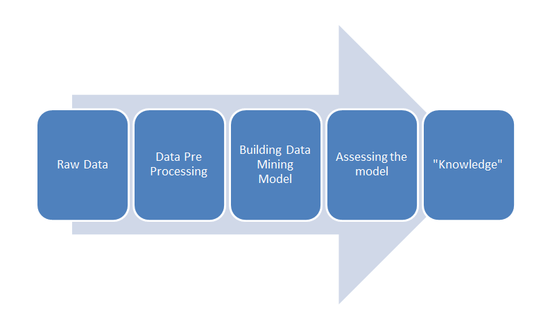

# Data Mining

Data Mining là khai thác dữ liệu.

Data Mining là quá trình tìm kiếm các mẫu từ tập dữ liệu lớn (Data Set) và phân tích dữ liệu từ những quan điểm khác nhau. Nó cho phép người dùng trong doanh nghiệp dùng để phân tích dữ liệu từ nhiều góc độ khác nhau và tóm tắt các mối quan hệ xác định (relationship).

Data Mining rất hữu ích trong việc tăng doanh thu và cắt giảm chi phí.

Ví dụ:
> Trong một siêu thị, người mua bàn chải đánh răng vào ngày chủ nhật cũng mua kem đánh răng. Thông tin này có thể được sử dụng trong việc tăng doanh thu bằng cách đặt 2 sản phẩm này cạnh nhau. Việc đó sẽ thúc đẩy việc tăng số lượng bán ra của 2 loại sản phẩm đó nhiều hơn vào những ngày chủ nhật.

Khái niệm về khai phá dữ liệu (Data Mining) hay khám phá tri thức (Knowledge Discovery) có rất nhiều cách diễn đạt khác nhau nhưng về bản chất đó là quá trình tự động trích xuất thông tin có giá trị (Thông tin dự đoán - Predictive Information) ẩn chứa trong khối lượng dữ liệu khổng lồ trong thực tế.

```mermaid
A [Data (Information)] --> B [Data Mining] --> C [Models (Knowledge)];
```
Data mining nhấn mạnh 2 khía cạnh chính đó là khả năng trích xuất thông tin có ích Tự động (Automated) và thông tin mang tính dự đoán (Predictive).

## Ứng dụng của Data Mining:

### Kinh doanh - thương mại:
- Xác định thói quen mua hàng của khách hàng
- Dự đoán chu kỳ kinh doanh sản phẩm
- Liên hệ giữa khách hàng và các yếu tố khác
- Xác định loại khách hàng tiềm năng, đối tượng có khả năng trở thành khách hàng
- Dự đoán hiệu quả của một đợt quảng cáo, tiếp thị

### Thương mại điện tử:
- Phân tích hành động duyệt Web để phát triển sở thích của khách hàng --> Cải thiện hoạt động Website...

### Ngân hàng:
- Dự đoán các dấu hiệu của một giao dịch trái luật
- Xác định các khách hàng sẽ cộng tác lâu dài
- Dự đoán rủi ro của các khoản cho vay
- Xác định các nhân tố dẫn đến vỡ nợ vay
- Liên hệ giữa các chỉ số tài chính với hoạt động ngân hàng

### Viễn thông:
- Nhận biết các dấu hiệu của sự gian lận dịch vụ
- Xu thế phát triển khách hàng, đối tượng, khu vực cần phát triển
 
### Bảo hiểm:
- Loại khách hàng có rủi ro cao? Gian lận?
- Liệu khách hàng có thực hiện hết hợp đồng bảo hiểm?
- Đối tượng, vùng nào có khả năng tham gia bảo hiểm?

### Y tế:
- Chuẩn đoán bệnh qua các triệu chứng
- Liên hệ giữa các loại bệnh
- Dự đoán hiệu quả của một cuộc phẫu thuật, điều trị

## Quy trình khai thác dữ liệu (Data Mining Process)

Data Mining phân tích các mối quan hệ và các mẫu trong các dữ liệu được lưu trữ dựa trên các truy vấn của người dùng. Khai thác dữ liệu liên quan đến những nhiệm vụ như sau:

- Association (Kết hợp): Tìm mối quan hệ giữa các biến.
> Ví dụ như trong một cửa hàng bán lẻ, có thể xác định sản phẩm được mua cùng với nhau thường xuyên và thông tin này có thể được sử dụng để tiếp thị các sản phẩm này.

- Clustering (Phân cụm): Xác định mối quan hệ hợp lý trong các sản phẩm và nhóm chúng lại với nhau.
> Ví dụ như trong một cửa hàng bán lẻ, kem đánh răng và bàn chải đánh răng có thể được nhóm lại.

- Classifying (Phân loại): Liên quan đến việc áp dụng một mô hình được biết đến với các dữ liệu mới.

## Các kỹ thuật cần sử dụng

Data mining liên quan chặt chẽ đến các lĩnh vực sau:
- Statistics (Thống kê): Kiểm định mô hình và đánh giá tri thức phát hiện ra
- Machine Learning (Máy học): Nghiên cứu xây dựng các giải thuật trên nền tảng của trí tuệ nhân tạo giúp cho máy tính có thể suy luận, dự đoán kết quả tương lai thông qua quá trình huấn luyện từ dữ liệu lịch sử.
- Database (Cở sở dữ liệu): Công nghệ quản trị dữ liệu, nhất là kho dữ liệu - data warehouse
- Visualization (Trực quan hóa): Giúp dữ liệu dễ hiểu, dễ sử dụng như chart, map

## Các kỹ thuật Data Mining

### Descriptive Data Mining

- Gom nhóm, phân cụm, nhận dạng
- Cây quyết định
- Khai phá luật kết hợp
- Phân tích sự phát triển và độ lệch
- Thống kê

### Predictive Data Mining

- Phân lớp, máy học, hệ chuyên gia
- Thống kê hồi quy
- Mạng nơ-ron
- Giải thuật di truyền

## Một số thuật toán phổ biến được dùng trong Data Mining

- Descision tree: Cây quyết định (Classification Task)
- Nearest Neighbor: Láng giềng gần nhất (Classification Task)
- Neural Network: Mạng Neural (Classification and Clustering Task)
- Rule Induction: Luật quy nạp (Classification Task)
- K-Means: Thuật toán K-Means (Clustering Task)

## Các công cụ Data Mining
- SQL Analyzer
- Intelligence Miner (IBM)
- SPSS

## Referral:
[Data Mining là gì?](http://forums.bsdinsight.com/threads/data-mining-la-gi.1007/)
